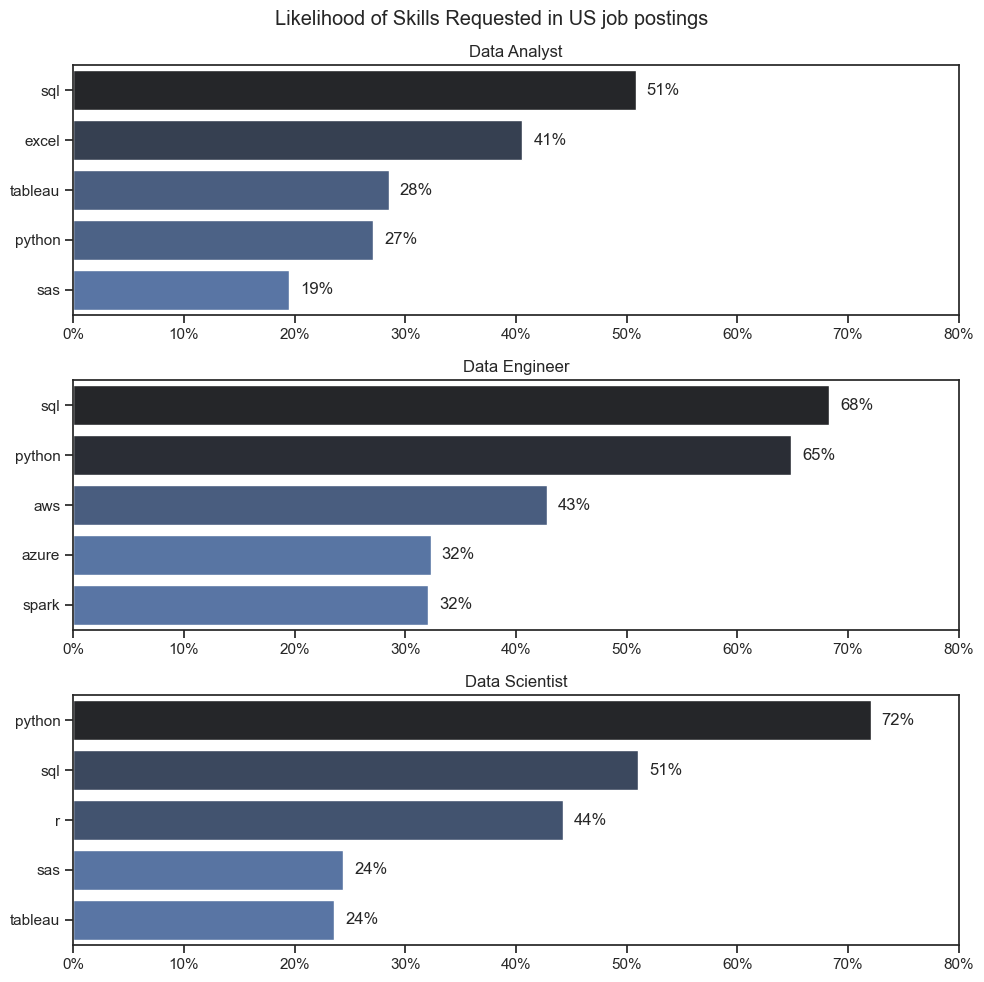
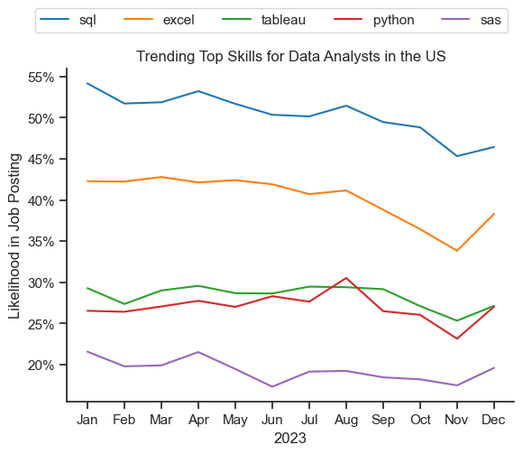
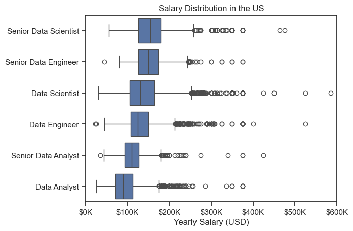
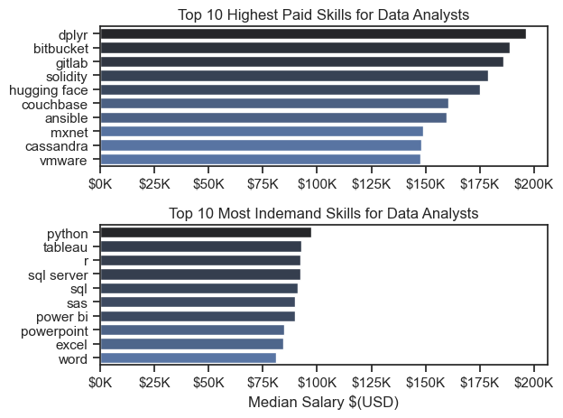
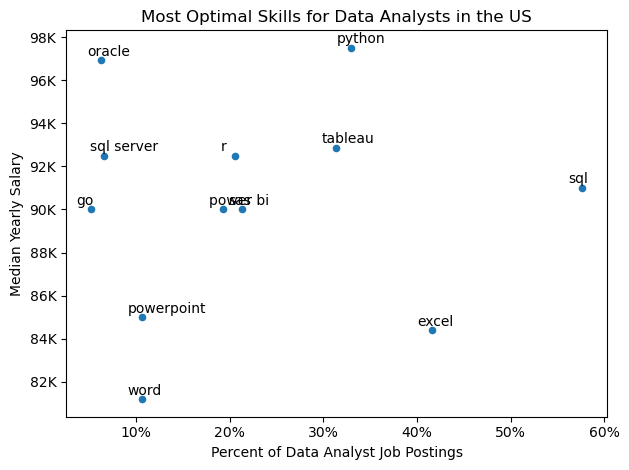

# Overview
Welcome to my analysis of the data job market, focusing on data analyst roles. This project was created out of a desire to navigate and understand the job market more effectively. It delves into the top-paying and in-demand skills to help find optimal job opportunities for data analysts.

The data used for analysis contains detailed information on job titles, salaries, locations, and essential skills. Through a series of Python scripts, I explore key questions such as the most demanded skills, salary trends, and the intersection of demand and salary in data analytics.

# The Questions

Below are the questions I want to answer in my project:

1. What are the skills most in demand for the top 3 most popular data roles?
2. How are in-demand skills trending for Data Analysts?
3. How well do jobs and skills pay for Data Analysts?
4. What are the optimal skills for data analysts to learn? (High Demand AND High Paying)

# Tools I Used

For my deep dive into the data analyst job market, I harnessed the power of several key tools:

- **Python**: The backbone of my analysis, allowing me to analyze the data and find critical insights.I also used the following Python libraries:
    - **Pandas Library**: This was used to analyze the data.
    - **Matplotlib Library**: I visualized the data.
    - **Seaborn Library**: Helped me create more advanced visuals.
- **Jupyter Notebooks**: The tool I used to run my Python scripts which let me easily include my notes and analysis.
- **Visual Studio Code**: My go-to for executing my Python scripts.
- **Git & GitHub**: Essential for version control and sharing my Python code and analysis, ensuring collaboration and project tracking.

# Data Preparation and Cleanup

This section outlines the steps taken to prepare the data for analysis, ensuring accuracy and usability

## Import & Clean Up Data
I start by importing necessary libraries and loading the dataset, followed by initial data cleaning tasks to ensure data quality.

```python
# Importing Libaries

import ast
import seaborn as sns
import pandas as pd
from datasets import load_dataset
import matplotlib.pyplot as plt

# Loading Data
dataset = load_dataset("lukebarousse/data_jobs")
df = dataset['train'].to_pandas()

# Cleaning data
df['job_posted_date'] = pd.to_datetime(df['job_posted_date'])
df['job_skills'] = df['job_skills'].apply(lambda skills: ast.literal_eval(skills) if pd.notna(skills) else skills)
```

## Filter US Jobs
To focus my analysis on the U.S. job market, I apply filters to the dataset, narrowing down to roles based in the United States.

```python
df_US = df[df['job_country'] == 'United States']
```

# The Analysis

## 1. What are the most demanded skills for the top 3 most popular data roles?

To find the most demanded skills for the top 3 most popular data roles. I filtered out those positions by which ones were the most popular, and got the top 5 skills for these top 3 roles. This query highlights the most popular job titles and their top skills, showing which skills I should pay attention to depending on the role I'm targeting.

View my notebook with detailed steps here : [Skill Demand](./2_Skill_Demand.ipynb)

```python
# Creating the visualization

job_titles = sorted(df_skills_perc['job_title_short'].unique().tolist()[:3])

fig, ax = plt.subplots(len(job_titles), 1)

sns.set_theme(style="ticks")
for i, job_title in enumerate(job_titles):
    df_plot = df_skills_perc[df_skills_perc['job_title_short'] == job_title].sort_values(by="skill_count", ascending=False).head(5)
    sns.barplot(data=df_plot, y="job_skills", x="skill_percent", ax=ax[i], legend=False, hue="skill_count", palette="dark:b_r")
    ax[i].set_ylabel("")
    ax[i].set_xlabel("")
    ax[i].set_title(job_title)
    # ax[i].invert_yaxis()
    ax[i].set_xlim(0, 80)
    ax[i].xaxis.set_major_formatter(plt.FuncFormatter(lambda x, pos: f"{int(x)}%"))

    for n, v in enumerate(df_plot['skill_percent']):
        ax[i].text(v + 1, n, f"{v:.0f}%", va="center")
    
fig.set_size_inches(10, 10)
fig.suptitle("Likelihood of Skills Requested in US job postings")
fig.tight_layout()

```

### Results



### Insights

- SQL is the most requested skill for Data Analysts and Data Scientists, with it in over half the job postings for both roles. For Data Engineers, Python is the most sought-after skill, appearing in 68% of job postings.
- Data Engineers require more specialized technical skills (AWS, Azure, Spark) compared to Data Analysts and Data Scientists who are expected to be proficient in more general data management and analysis tools (Excel, Tableau).
- Python is a versatile skill, highly demanded across all three roles, but most prominently for Data Scientists (72%) and Data Engineers (65%).

## 2. How are in-demand skills trending for Data Analysts?

To find how skills are trending in 2023 for Data Analysts, I filtered data analyst positions and grouped the skills by the month of the job postings. This got me the top 5 skills of data analysts by month, showing how popular skills were throughout 2023.

View my notebook with detailed steps here: [Skill Trend](./3_Skill_Trend.ipynb)

### Visualize Data
```python
# Plotting the line graph

df_plot = df_DA_US_percent.iloc[:, :5]

sns.set_theme(style="ticks")
sns.lineplot(data=df_plot, dashes=False, palette="tab10")
sns.despine()

plt.title("Trending Top Skills for Data Analysts in the US")
plt.ylabel("Likelihood in Job Posting")
plt.xlabel('2023')
plt.legend(loc="upper right", bbox_to_anchor=(1, 1.2), ncol=5)

from matplotlib.ticker import PercentFormatter
ax=plt.gca()
ax.yaxis.set_major_formatter(PercentFormatter(decimals=0))
```

### Results


### Insights

- SQL remains the most consistently demanded skill throughout the year, although it shows a gradual decrease in demand.
- Excel experienced a significant increase in demand starting around November, maintaining the gap with both Python and Tableau by the end of the year.
- Both Python and Tableau show relatively stable demand throughout the year with some fluctuations but remain essential skills for data analysts. SAS, while less demanded compared to the others, shows a slight upward trend towards the year's end.

## 3. How well do jobs and skills pay for Data Analysts?

To identify the highest-paying roles and skills, I only got jobs in the United States and looked at their median salary. But first I looked at the salary distributions of common data jobs like Data Scientist, Data Engineer, and Data Analyst, to get an idea of which jobs are paid the most.

View my notebook with detailed steps here : [Salary Analysis](./4_Salary_Analysis.ipynb)

### Visualize Data

```python
sns.boxplot(data=df_US_top6, x="salary_year_avg", y="job_title_short", order=job_order)
sns.set_theme(style="ticks")

plt.title("Salary Distribution in the US")
plt.xlabel("Yearly Salary (USD)")
plt.ylabel("")
plt.xlim(0, 600000)
ticks_x = plt.FuncFormatter(lambda y, pos: f'${int(y/1000)}K')
plt.gca().xaxis.set_major_formatter(ticks_x)
plt.show()
```

### Results



### Insights

- There's a significant variation in salary ranges across different job titles. Senior Data Scientist positions tend to have the highest salary potential, with up to $600K, indicating the high value placed on advanced data skills and experience in the industry.
- Senior Data Engineer and Senior Data Scientist roles show a considerable number of outliers on the higher end of the salary spectrum, suggesting that exceptional skills or circumstances can lead to high pay in these roles. In contrast, Data Analyst roles demonstrate more consistency in salary, with fewer outliers.
- The median salaries increase with the seniority and specialization of the roles. Senior roles (Senior Data Scientist, Senior Data Engineer) not only have higher median salaries but also larger differences in typical salaries, reflecting greater variance in compensation as responsibilities increase.

## Highest Paid & Most Demanded Skills for Data Analysts

Next, I narrowed my analysis and focused only on data analyst roles. I looked at the highest-paid skills and the most in-demand skills. I used two bar charts to showcase these.

### Visualization Data

```python
fig, ax= plt.subplots(2,1)

sns.set_theme(style="ticks")

# Top 10 Highest Paid Skills for Data Analysts
sns.barplot(data=df_DA_top_pay, x='median', y=df_DA_top_pay.index, hue='median', ax=ax[0], palette='dark:b_r')
ax[0].legend().remove()
ax[0].set_title('Top 10 Highest Paid Skills for Data Analysts')
ax[0].set_ylabel('')
ax[0].set_xlabel('')
ax[0].xaxis.set_major_formatter(plt.FuncFormatter(lambda x, _ : f"${int(x/1000)}K"))

# Top 10 Most Indemand Skills for Data Analysts
sns.barplot(data=df_DA_top_skills, x='median', y=df_DA_top_skills.index, hue='median', ax=ax[1], palette='dark:b_r')
ax[1].legend().remove()
ax[1].set_title('Top 10 Most Indemand Skills for Data Analysts')
ax[1].set_ylabel('')
ax[1].set_xlabel('Median Salary $(USD)')
ax[1].xaxis.set_major_formatter(plt.FuncFormatter(lambda x, _ : f"${int(x/1000)}K"))
ax[1].set_xlim(ax[0].get_xlim())

fig.tight_layout()
```

### Results



### Insights

- The top graph shows specialized technical skills like `dplyr`, `Bitbucket`, and `Gitlab` are associated with higher salaries, some reaching up to $200K, suggesting that advanced technical proficiency can increase earning potential.
- The bottom graph highlights that foundational skills like `Excel`, `PowerPoint`, and `SQL` are the most in-demand, even though they may not offer the highest salaries. This demonstrates the importance of these core skills for employability in data analysis roles.
- There's a clear distinction between the skills that are highest paid and those that are most in-demand. Data analysts aiming to maximize their career potential should consider developing a diverse skill set that includes both high-paying specialized skills and widely demanded foundational skills.

## What are the most optimal skills to learn for Data Analysts?

To identify the most optimal skills to learn ( the ones that are the highest paid and highest in demand) I calculated the percent of skill demand and the median salary of these skills. To easily identify which are the most optimal skills to learn.

View my notebook with detailed steps here : [Optimal Skills](./5_Optimal_Skills.ipynb)

### Visualize Data

```python

df_DA_skills_high_demand.plot(kind='scatter', x='skill_percent', y='median_salary')

for i,txt in enumerate(df_DA_skills_high_demand.index):
    plt.text(df_DA_skills_high_demand['skill_percent'].iloc[i] - 1.5, df_DA_skills_high_demand['median_salary'].iloc[i] + 210, txt)

# Set Axis lables, title and legend
plt.xlabel("Percent of Data Analyst Job Postings")
plt.ylabel("Median Yearly Salary")
plt.title("Most Optimal Skills for Data Analysts in the US")

# Formatting the ytickers
from matplotlib.ticker import PercentFormatter

ax=plt.gca()
ax.yaxis.set_major_formatter(plt.FuncFormatter(lambda y, _: f"{int(y/1000)}K"))
ax.xaxis.set_major_formatter(PercentFormatter(decimals=0))

plt.tight_layout()
plt.show()
```

### Results


### Insights

- The skill `Oracle` appears to have the highest median salary of nearly $97K, despite being less common in job postings. This suggests a high value placed on specialized database skills within the data analyst profession.
- More commonly required skills like `Excel` and `SQL` have a large presence in job listings but lower median salaries compared to specialized skills like `Python` and `Tableau`, which not only have higher salaries but are also moderately prevalent in job listings.
- Skills such as `Python`, `Tableau` are towards the higher end of the salary spectrum while also being fairly common in job listings, indicating that proficiency in these tools can lead to good opportunities in data analytics.

## Visualizing Different Technologies

Let's visualize the different technologies as well in the graph. We'll add color labels based on the technology (e.g., {Programming: Python})

### Visualize Data

```python
from matplotlib.ticker import PercentFormatter
# df_DA_skills_high_demand.plot(kind='scatter', x='skill_percent', y='median_salary')

sns.scatterplot(
    data=df_DA_skills_high_demand,
    x='skill_percent',
    y='median_salary',
    hue='technology'
)
sns.despine()
for i,txt in enumerate(df_DA_skills_high_demand.index):
    plt.text(df_DA_skills_high_demand['skill_percent'].iloc[i] - 1.5, df_DA_skills_high_demand['median_salary'].iloc[i] + 210, txt)

# Set Axis lables, title and legend
plt.xlabel("Percent of Data Analyst Job Postings")
plt.ylabel("Median Yearly Salary")
plt.title("Most Optimal Skills for Data Analysts in the US")

# Formatting the yticker

ax=plt.gca()
ax.yaxis.set_major_formatter(plt.FuncFormatter(lambda y, _: f"{int(y/1000)}K"))
ax.xaxis.set_major_formatter(PercentFormatter(decimals=0))

plt.tight_layout()
plt.show()
```

### Results


### Insights

- The scatter plot shows that most of the `programming` skills (colored blue) tend to cluster at higher salary levels compared to other categories, indicating that programming expertise might offer greater salary benefits within the data analytics field.
- The database skills (colored green), such as `sql server`, are associated with some of the highest salaries among databases. This indicates a significant demand and valuation for data management and manipulation expertise in the industry.
- Analyst tools (colored orange), including `Tableau` and `Power BI`, are prevalent in job postings and offer competitive salaries, showing that visualization and data analysis software are crucial for current data roles. This category not only has good salaries but is also versatile across different types of data tasks.

# What I Learned

Throughout this project, I deepened my understanding of the data analyst job market and enhanced my technical skills in Python, especially in data manipulation and visualization. Here are a few specific things I learned:

- **Advanced Python Usage**: Utilizing libraries such as Pandas for data manipulation, Seaborn and Matplotlib for data visualization, and other libraries helped me perform complex data analysis tasks more efficiently.
- **Data Cleaning Importance**: I learned that thorough data cleaning and preparation are crucial before any analysis can be conducted, ensuring the accuracy of insights derived from the data.
- **Strategic Skill Analysis**: The project emphasized the importance of aligning one's skills with market demand. Understanding the relationship between skill demand, salary, and job availability allows for more strategic career planning in the tech industry.

# Insights

This project provided several general insights into the data job market for analysts:

- **Skill Demand and Salary Correlation**: There is a clear correlation between the demand for specific skills and the salaries these skills command. Advanced and specialized skills like Python and Oracle often lead to higher salaries.
- **Market Trends**: There are changing trends in skill demand, highlighting the dynamic nature of the data job market. Keeping up with these trends is essential for career growth in data analytics.
- **Economic Value of Skills**: Understanding which skills are both in-demand and well-compensated can guide data analysts in prioritizing learning to maximize their economic returns.

# Challenges I Faced

This project was not without its challenges, but it provided good learning opportunities:

- **Data Inconsistencies**: Handling missing or inconsistent data entries requires careful consideration and thorough data-cleaning techniques to ensure the integrity of the analysis.
- **Complex Data Visualization**: Designing effective visual representations of complex datasets was challenging but critical for conveying insights clearly and compellingly.
- **Balancing Breadth and Depth**: Deciding how deeply to dive into each analysis while maintaining a broad overview of the data landscape required constant balancing to ensure comprehensive coverage without getting lost in details.

# Conclusion

This exploration into the data analyst job market has been incredibly informative, highlighting the critical skills and trends that shape this evolving field. The insights I got enhance my understanding and provide actionable guidance for anyone looking to advance their career in data analytics. As the market continues to change, ongoing analysis will be essential to stay ahead in data analytics. This project is a good foundation for future explorations and underscores the importance of continuous learning and adaptation in the data field.